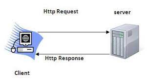

# Movies-Liberay - 1.0.0
**Author Name**: Anas

## WRRC

## Overview
Movies-Library is a web-based application for managing and organizing movie collections. The app provides a platform for users to keep track of their favorite movies, add new titles to their collection, and rate and review movies they have watched. With Movies-Library, users can easily search for movies by title, director, actors, and genre.
## Getting Started
npm i
## Project Features
title of movie and path and over view
search for movie
and link
post to addMovie 